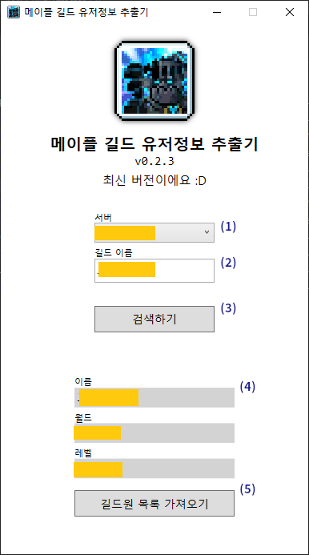
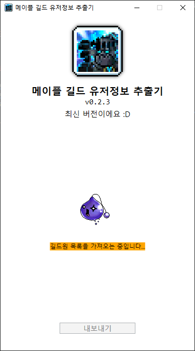
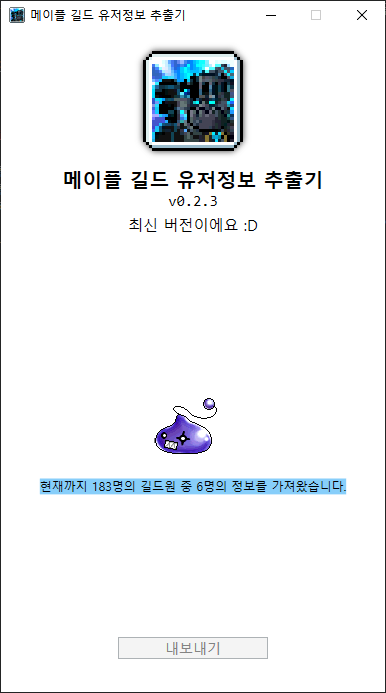
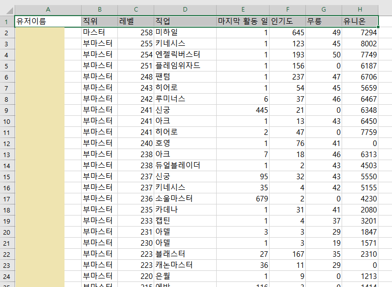

# kms-guild-extractor

길드원 정보를 크롤링하여 csv파일로 추출할 수 있습니다.

## Discussions
툴과 관련된 문의나 건의사항은 [GitHub Discussions](https://github.com/pid011/kms-guild-extractor/discussions)로 부탁드립니다!

## 설치방법

<https://dotnet.microsoft.com/en-us/download>

위의 링크로 들어가 .NET Runtime을 설치해주세요. **(필수)**

런타임을 설치한 후에 아래 링크로 들어가 최신 버전의 릴리즈 압축파일을 다운받아 사용하면 됩니다.

<https://github.com/pid011/kms-guild-extractor/releases>

## 사용 방법

1. 검색할 길드의 서버를 선택합니다.
2. 검색할 길드의 이름을 입력합니다.
3. 검색하기 버튼을 눌러서 길드를 검색할 수 있습니다.
4. 길드 검색결과가 존재하면 버튼을 눌러서 길드원 정보 가져오기 작업을 시작할 수 있습니다.

작업을 시작하면 먼저 메이플 공식 홈페이지에서 길드원 목록을 가져오는 작업을 수행합니다. 인원이 많을수록 약간 오래 걸립니다.

길드원 목록을 가져오고 나면 각각의 길드원에 대한 정보를 maple.gg 에서 동기화하고 가져오는 작업을 순차적으로 진행합니다. 인원이 많으면 많을 수록 이 과정에서 시간이 많이 걸립니다.

가져오는 작업을 전부 완료하면 내보내기 버튼이 활성화되며 csv파일로 저장이 가능합니다.

## 데이터 설명

| 데이터         | 설명                                                                                                                                                |
| :------------- | :-------------------------------------------------------------------------------------------------------------------------------------------------- |
| 유저 이름      | 유저 이름입니다.                                                                                                                                    |
| 직위           | 길드 내 유저의 직위입니다.                                                                                                                          |
| 레벨           | 유저의 레벨입니다.                                                                                                                                  |
| 직업           | 유저의 직업입니다.                                                                                                                                  |
| 마지막 활동 일 | maple.gg에서 제공하는 마지막 활동 일입니다. 인게임에서 제공하는 길드원의 접속일과 차이가 날 수 있습니다. 데이터가 존재하지 않을 시 -1로 표시됩니다. |
| 인기도         | 유저의 인기도입니다. 데이터가 존재하지 않을 시 0으로 표시됩니다.                                                                                    |
| 무릉           | 유저의 무릉 층 수입니다. 데이터가 존재하지 않을 시 0으로 표시됩니다.                                                                                |
| 유니온         | 유저의 유니온 레벨입니다. 데이터가 존재하지 않을 시 0으로 표시됩니다.                                                                               |

- 오랫동안 접속하지 않은 캐릭터의 경우 maple.gg의 데이터가 없어서 기본 값으로 표시됩니다.
- 유니온은 메이플 랭킹 표시 조건에 의해 유저의 캐릭터들 중 가장 레벨이 높은 캐릭터만 제공되므로 부캐의 경우 유니온이 표시되지 않습니다.
